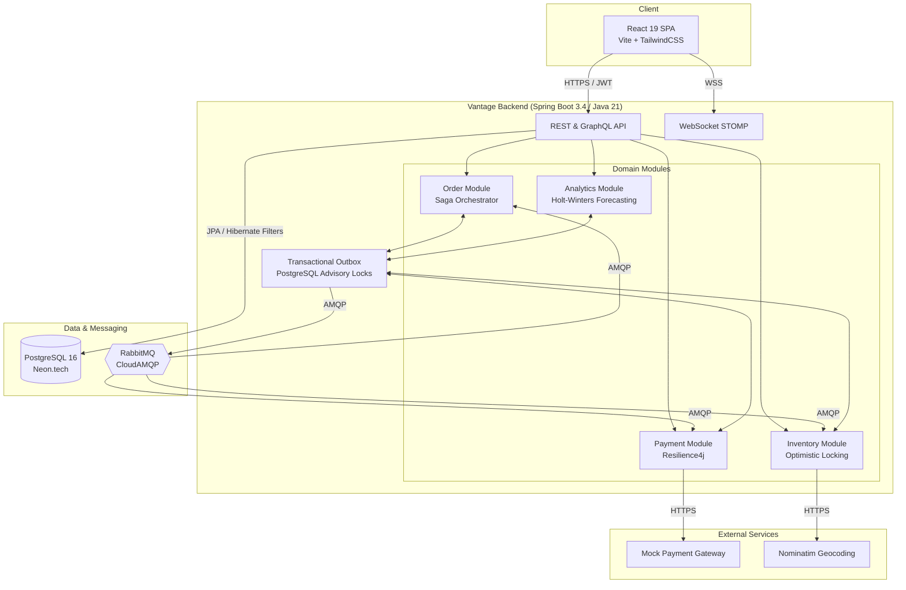

# Vantage

> A production-grade, multi-tenant SaaS platform enabling independent merchants to manage operations, with distributed order orchestration, AI-driven forecasting, and end-to-end observability.

[](https://openjdk.org/projects/jdk/21/)
[](https://spring.io/projects/spring-boot)
[](https://react.dev/)
[](https://www.postgresql.org/)
[](https://www.rabbitmq.com/)
[](LICENSE)

Vantage is a comprehensive vendor operations platform designed to demonstrate advanced full-stack engineering and distributed systems architecture. It solves complex enterprise challenges such as flash-sale concurrency, distributed transactional consistency, and real-time observability, all deployed on a $0 hosting budget.

---

## Table of Contents
- [Architecture Overview](#architecture-overview)
- [Core Platform Capabilities](#core-platform-capabilities)
- [Technology Stack](#technology-stack)
- [Engineering Maturity & DevSecOps](#engineering-maturity--devsecops)
- [Quickstart (Local Development)](#quickstart-local-development)
- [System Tour](#system-tour)
- [Project Structure & Documentation](#project-structure--documentation)

---

## Architecture Overview

Vantage is built as a Modular Monolith using Spring Modulith. This provides strict bounded contexts (Vendor, Product, Inventory, Order, Payment) while maintaining the operational simplicity of a single deployable unit.



---

## Core Platform Capabilities

The platform implements enterprise-grade patterns to ensure data integrity, resilience, and performance:

1. **Enterprise-Grade Multi-Tenancy**: Strict data isolation is enforced at the ORM layer using Hibernate `@FilterDef` and `ThreadLocal` tenant contexts. A vendor can never access another vendor's data, guaranteed by the database layer.
2. **High-Concurrency Inventory Management**: Inventory updates utilize JPA `@Version` for optimistic locking. During traffic spikes, the database prevents overselling without pessimistic locks, and the API gracefully returns `409 Conflict` with RFC 7807 Problem Details.
3. **Distributed Transaction Orchestration**: The platform solves the dual-write problem via a transactional outbox. Database commits and RabbitMQ publications are guaranteed. If a payment fails, a compensating transaction is automatically orchestrated to release the reserved inventory.
4. **Resilient Integrations**: External calls (Payment Gateway, Geocoding) are wrapped in Resilience4j Circuit Breakers, Bulkheads, Rate Limiters, and Retries. The system fails fast and degrades gracefully.
5. **End-to-End Observability**: Distributed tracing via OpenTelemetry provides full visibility. A single order placement can be traced from the React frontend, through the Spring Boot API, JPA queries, Outbox Poller, RabbitMQ, and asynchronous consumers in Grafana Tempo.
6. **Demand Forecasting Engine**: A custom pure-Java implementation of the Holt-Winters Triple Exponential Smoothing algorithm generates 7-day demand forecasts with 95% confidence intervals without relying on external ML libraries.
7. **CQRS Read Model**: Order search queries hit a denormalized `order_search_view` projection built asynchronously from domain events, ensuring read-optimized performance.
8. **Developer-First API Design**: Idempotent payment endpoints (`Idempotency-Key` header) and HMAC-SHA256 signed webhooks with exponential backoff and dead-letter queues provide a robust integration surface for external systems.

---

## Technology Stack

| Category | Technology | Details |
|----------|------------|---------|
| **Backend** | Java 21, Spring Boot 3.4 | Virtual Threads, Spring Modulith, Spring Security, Spring Data JPA |
| **Frontend** | React 19, Vite, TypeScript | TanStack Query/Table, Zustand, TailwindCSS, Recharts, Leaflet |
| **Database** | PostgreSQL 16 | Flyway migrations, Full-Text Search, CQRS, Optimistic Locking |
| **Messaging** | RabbitMQ | Transactional Outbox, Publisher Confirms, Dead Letter Queues |
| **Observability**| OpenTelemetry, Grafana Stack | Tempo (Traces), Loki (Logs), Prometheus (Metrics) |
| **Infrastructure**| Docker, GitHub Actions | Testcontainers, PITest, k6 Load Testing, SonarCloud, CodeQL |

---

## Engineering Maturity & DevSecOps

- **Testing**: >80% line coverage enforced by JaCoCo. >70% mutation score enforced by PITest. Property-based testing using jqwik for the forecasting algorithm.
- **Architecture Enforcement**: Spring Modulith verification tests and ArchUnit rules prevent architectural drift.
- **CI/CD**: GitHub Actions matrix builds (JDK 21/22), automated Trivy container scanning, Dependabot, and Semantic Versioning via `release-please`.
- **Performance**: k6 load testing simulating 1,000 concurrent users, validating P95 latency < 200ms.

---

## Quickstart (Local Development)

### Prerequisites
- Java 21
- Node.js 20+
- Docker & Docker Compose

### 1. Start Infrastructure
```bash
docker-compose up -d
```
*Starts PostgreSQL (5432), RabbitMQ (5672/15672), Prometheus (9090), and Grafana (3000).*

### 2. Start Backend
```bash
cd backend
./gradlew bootRun
```
*API available at `http://localhost:8080`. Swagger UI at `http://localhost:8080/swagger-ui.html`.*

### 3. Start Frontend
```bash
cd frontend
npm install
npm run dev
```
*Dashboard available at `http://localhost:5173`.*

---

## System Tour

A brief walkthrough of the platform's operational flow:

1. **UI & State Management**: The React 19 dashboard utilizes optimistic updates for instant feedback, a `Cmd+K` command palette for power users, and TanStack Virtual for rendering large datasets at 60fps.
2. **Concurrency Handling**: Setting a product's inventory to `1` and simulating simultaneous purchases demonstrates the optimistic lock in action. One request succeeds, while others receive a clean `409 Conflict` without server degradation.
3. **Distributed Saga & Compensation**: Toggling a "Simulate Payment Gateway Failure" flag triggers the Chaos Monkey. An order is placed, inventory decrements, and payment fails. The Saga orchestrator automatically fires a compensating transaction, restoring the inventory and marking the order as `CANCELLED`.
4. **Observability**: The failed transaction is fully traceable in Grafana Tempo. The 14-span waterfall highlights the HTTP ingress, JPA save, Outbox polling, RabbitMQ publish, Circuit Breaker trip, and the final inventory restoration.
5. **Analytics & Real-Time Ops**: The platform features a pure-Java Holt-Winters forecasting chart with confidence intervals. A live operations dashboard uses WebSockets to drop pulsing pins on a Leaflet.js map as orders ship globally in real-time.

---

## Project Structure & Documentation

This repository uses a strict, code-free documentation architecture to fuel AI-driven development. All specifications, contracts, and tasks are defined in the `docs/` directory.

```text
vantage/
├── backend/                      # Spring Boot 3.4 + Java 21
├── frontend/                     # React 19 + Vite
├── docs/
│   ├── 00-product/               # Vision, Personas, and Business Rules
│   ├── 01-architecture/          # System Design, ADRs, and C4 Diagrams
│   ├── 02-contracts/             # AsyncAPI (YAML), OpenAPI (YAML), DB Schema
│   ├── 03-meta/                  # AI Agent Protocol & Coding Standards
│   ├── 04-tasks/                 # 50 Isolated AI Work Orders (Task Manifests)
│   └── 05-ops/                   # Deployment & Local Dev Guides
├── scripts/
│   └── dispatch.sh               # Injects context into AI prompts for task execution
└── README.md
```
