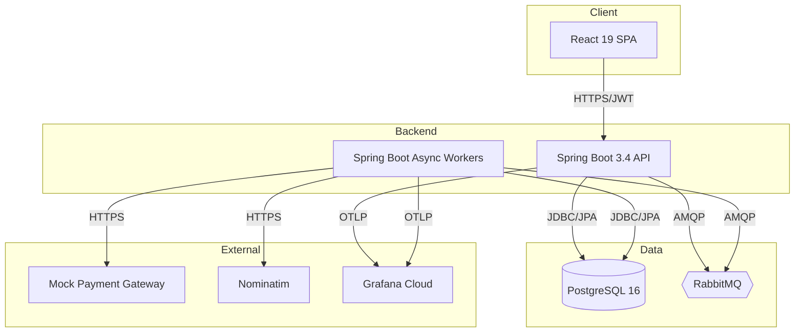

# Vantage

[](https://adoptium.net/)
[](https://spring.io/projects/spring-boot)
[](https://react.dev/)
[](https://www.postgresql.org/)
[](https://www.rabbitmq.com/)
[](https://github.com/your-org/vantage/actions)
[](LICENSE)

> **A production‑grade, multi‑tenant SaaS platform** for independent merchants – with distributed order orchestration, optimistic concurrency control, and AI‑driven demand forecasting.


---

## 🚀 Why Vantage?

Vantage is not a toy project – it’s a **full‑stack demonstration of senior‑level engineering**.
Every feature is designed to solve real‑world distributed systems problems:

- **Multi‑tenant isolation** – Hibernate `@Filter` guarantees zero data leakage between vendors.
- **Flash‑sale concurrency** – JPA `@Version` optimistic locking prevents overselling without database locks.
- **Distributed Saga + Outbox** – At‑least‑once delivery with compensating transactions (Chaos Monkey).
- **Resilience4j** – Circuit breakers, retries, bulkheads, and rate limiters for graceful degradation.
- **End‑to‑end tracing** – OpenTelemetry and Grafana Tempo stitch together every request and event.
- **Pure‑Java AI forecasting** – Holt‑Winters exponential smoothing with confidence intervals.

---

## 📐 Architecture Overview


```mermaid
graph TB
    subgraph Client
        React[React 19 SPA]
    end

    subgraph Backend
        API[Spring Boot 3.4 API]
        Worker[Spring Boot Async Workers]
    end

    subgraph Data
        PG[(PostgreSQL 16)]
        RMQ{{RabbitMQ}}
    end

    subgraph External
        Pay[Mock Payment Gateway]
        Geo[Nominatim]
        Grafana[Grafana Cloud]
    end

    React -- HTTPS/JWT --> API
    API -- JDBC/JPA --> PG
    API -- AMQP --> RMQ
    Worker -- AMQP --> RMQ
    Worker -- JDBC/JPA --> PG
    Worker -- HTTPS --> Pay
    Worker -- HTTPS --> Geo
    API -- OTLP --> Grafana
    Worker -- OTLP --> Grafana
```

---

## 🧰 Technology Stack

| Layer          | Technologies                                                                 |
|----------------|------------------------------------------------------------------------------|
| **Backend**    | Java 21, Spring Boot 3.4, Spring Modulith, Hibernate, Flyway, JWT, Resilience4j |
| **Frontend**   | React 19, TypeScript, Vite, TanStack Query, Tailwind CSS, Recharts, Leaflet   |
| **Infrastructure** | PostgreSQL 16, RabbitMQ, Testcontainers, Docker Compose                  |
| **Observability**  | Micrometer, OpenTelemetry, Grafana Tempo, Loki, Prometheus               |

---

## ⚡ Quickstart (Local Development)

```bash
git clone https://github.com/your-org/vantage.git
cd vantage

# Start PostgreSQL and RabbitMQ
docker-compose up -d

# Run the backend
cd backend
./gradlew bootRun

# Run the frontend (in another terminal)
cd frontend
npm install
npm run dev
```

Open [http://localhost:5173](http://localhost:5173) and start exploring.

---

## 📺 90‑Second Demo Script

A complete walkthrough of the platform’s key features is available in  
[docs/demo-script.md](docs/demo-script.md) – perfect for your Loom video.

---

## 🤝 Contributing

We welcome contributions! Please read our  
[Contribution Guidelines](CONTRIBUTING.md) and  
[Code of Conduct](CODE_OF_CONDUCT.md) before opening a pull request.

---

## 📄 License

Proprietary – all rights reserved.
EOF
