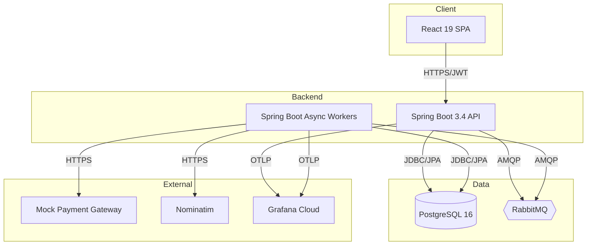

<div align="center">
  
  <p>
    <strong>Vantage</strong> — A production‑grade, multi‑tenant SaaS platform for independent merchants – with distributed order orchestration, optimistic concurrency control, and AI‑driven demand forecasting.
  </p>
  <p>
    <a href="https://adoptium.net/"></a>
    <a href="https://spring.io/projects/spring-boot"></a>
    <a href="https://react.dev/"></a>
    <a href="https://www.postgresql.org/"></a>
    <a href="https://www.rabbitmq.com/"></a>
    <a href="https://github.com/elcoosp/vantage/actions"></a>
    <a href="LICENSE"></a>
  </p>
</div>

---

## Why Vantage?

Vantage is a full‑stack demonstration of senior‑level engineering, designed to solve real‑world distributed systems problems:

- Multi‑tenant isolation – Hibernate `@Filter` guarantees zero data leakage between vendors.
- Flash‑sale concurrency – JPA `@Version` optimistic locking prevents overselling without database locks.
- Distributed Saga + Outbox – At‑least‑once delivery with compensating transactions (Chaos Monkey).
- Resilience4j – Circuit breakers, retries, bulkheads, and rate limiters for graceful degradation.
- End‑to‑end tracing – OpenTelemetry and Grafana Tempo stitch together every request and event.
- Pure‑Java AI forecasting – Holt‑Winters exponential smoothing with confidence intervals.

---

## Architecture Overview


```mermaid
graph TB
    subgraph Client
        React[React 19 SPA]
    end

    subgraph Backend
        API[Spring Boot 3.4 API]
        Worker[Spring Boot Async Workers]
    end

    subgraph Data
        PG[(PostgreSQL 16)]
        RMQ{{RabbitMQ}}
    end

    subgraph External
        Pay[Mock Payment Gateway]
        Geo[Nominatim]
        Grafana[Grafana Cloud]
    end

    React -- HTTPS/JWT --> API
    API -- JDBC/JPA --> PG
    API -- AMQP --> RMQ
    Worker -- AMQP --> RMQ
    Worker -- JDBC/JPA --> PG
    Worker -- HTTPS --> Pay
    Worker -- HTTPS --> Geo
    API -- OTLP --> Grafana
    Worker -- OTLP --> Grafana
```

---

## Technology Stack

| Layer          | Technologies                                                                 |
|----------------|------------------------------------------------------------------------------|
| Backend        | Java 21, Spring Boot 3.4, Spring Modulith, Hibernate, Flyway, JWT, Resilience4j |
| Frontend       | React 19, TypeScript, Vite, TanStack Query, Tailwind CSS, Recharts, Leaflet   |
| Infrastructure | PostgreSQL 16, RabbitMQ, Testcontainers, Docker Compose                  |
| Observability  | Micrometer, OpenTelemetry, Grafana Tempo, Loki, Prometheus               |

---

## Quickstart (Local Development)

```bash
git clone https://github.com/elcoosp/vantage.git
cd vantage

# Start PostgreSQL and RabbitMQ
docker-compose up -d

# Run the backend
cd backend
./gradlew bootRun

# Run the frontend (in another terminal)
cd frontend
npm install
npm run dev
```

Open [http://localhost:5173](http://localhost:5173) and start exploring.

---

## Contributing

Please read our [Contribution Guidelines](CONTRIBUTING.md) and [Code of Conduct](CODE_OF_CONDUCT.md) before submitting pull requests.

---

## License

Proprietary – see [LICENSE](LICENSE) for details.
EOF
