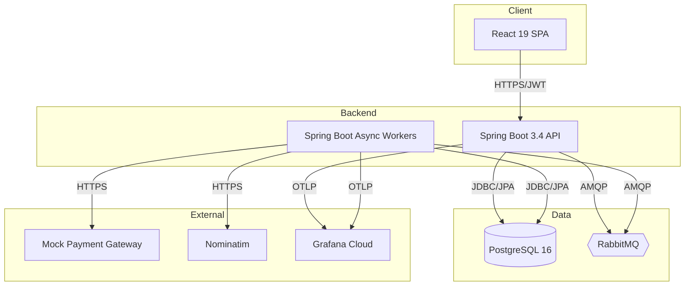

# Vantage

*A production-grade, multi-tenant SaaS platform enabling independent merchants to manage operations, with distributed order orchestration and AI-driven forecasting.*


---

## Architecture Overview

Vantage is built as a modular monolith with clear separation of concerns, leveraging Spring Modulith for bounded contexts and asynchronous event-driven communication via RabbitMQ.


```mermaid
graph TB
    subgraph Client
        React[React 19 SPA]
    end

    subgraph Backend
        API[Spring Boot 3.4 API]
        Worker[Spring Boot Async Workers]
    end

    subgraph Data
        PG[(PostgreSQL 16)]
        RMQ{{RabbitMQ}}
    end

    subgraph External
        Pay[Mock Payment Gateway]
        Geo[Nominatim]
        Grafana[Grafana Cloud]
    end

    React -- HTTPS/JWT --> API
    API -- JDBC/JPA --> PG
    API -- AMQP --> RMQ
    Worker -- AMQP --> RMQ
    Worker -- JDBC/JPA --> PG
    Worker -- HTTPS --> Pay
    Worker -- HTTPS --> Geo
    API -- OTLP --> Grafana
    Worker -- OTLP --> Grafana
```

---

## The "Wow" Features

- **Multi-Tenant Isolation** – Hibernate `@Filter` ensures tenant data is never leaked across vendors.
- **Flash-Sale Concurrency** – JPA `@Version` optimistic locking prevents overselling under high load.
- **Distributed Saga & Outbox Pattern** – At‑least‑once delivery with Transactional Outbox ensures consistency across services.
- **Resilience4j Circuit Breakers & Retries** – Graceful degradation and automatic recovery from downstream failures.
- **OpenTelemetry End-to-End Tracing** – Distributed traces span the React frontend, API, workers, and external calls.
- **Pure-Java AI Demand Forecasting** – Holt‑Winters exponential smoothing with confidence intervals, built entirely in Java 21.

---

## Technology Stack

| Layer          | Technologies                                                                 |
|----------------|------------------------------------------------------------------------------|
| **Backend**    | Java 21, Spring Boot 3.4, Spring Modulith, Hibernate, Flyway, JWT, Resilience4j |
| **Frontend**   | React 19, TypeScript, Vite, TanStack Query, Tailwind CSS, Recharts, Leaflet   |
| **Infrastructure** | PostgreSQL 16, RabbitMQ, Testcontainers, Docker Compose                  |
| **Observability**  | Micrometer, OpenTelemetry, Grafana Tempo, Loki, Prometheus               |

---

## Quickstart (Local Development)

1. **Clone the repository**
   ```bash
   git clone https://github.com/your-org/vantage.git
   cd vantage
   ```

2. **Start dependencies (PostgreSQL & RabbitMQ)**
   ```bash
   docker-compose up -d
   ```

3. **Run the backend**
   ```bash
   cd backend
   ./gradlew bootRun
   ```

4. **Run the frontend**
   ```bash
   cd frontend
   npm install
   npm run dev
   ```

5. **Open** `http://localhost:5173` and start using Vantage.

## Contributing

Please read our [Contribution Guidelines](CONTRIBUTING.md) and [Code of Conduct](CODE_OF_CONDUCT.md) before submitting pull requests.

---

## License

Proprietary – all rights reserved.
