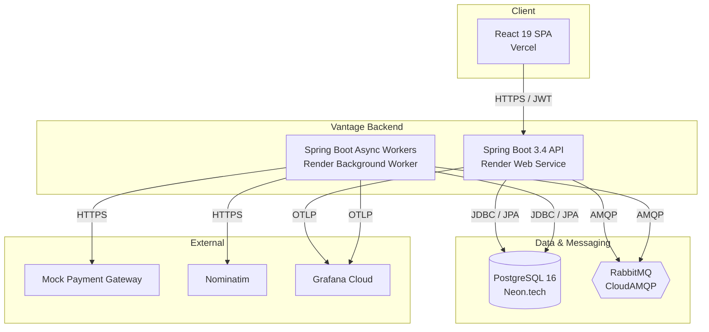
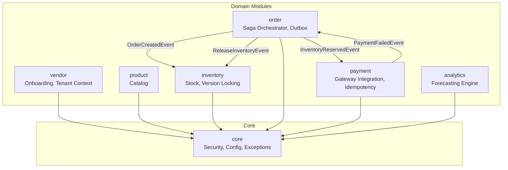

# Vantage: Architecture & System Design Specification

| Field | Value |
|-------|-------|
| Project | Vantage |
| Document | System Design & Architecture (Level 3) |
| Version | 1.0 |
| Date | 2026-07-23 |
| Status | Approved |

## 1. Introduction and Scope
This document defines the structural architecture for Vantage. It outlines the Architecturally Significant Requirements (ASRs), the C4 model diagrams, and the modular boundaries that enforce separation of concerns. AI agents must use this document to understand which modules they are allowed to modify and how data flows between them.

## 2. Architecturally Significant Requirements (ASRs)
The architecture is driven by the following ASRs extracted from the product specifications:

- **ASR-01: Strict Data Isolation:** The system must guarantee that a tenant (vendor) can never access another tenant's data. This must be enforced at the ORM layer rather than application logic to prevent accidental data leakage.
- **ASR-02: Flash-Sale Concurrency:** The system must handle concurrent inventory decrements without database-level pessimistic locking, relying instead on optimistic locking to maximize throughput and prevent overselling.
- **ASR-03: Distributed Transactional Consistency:** The system must solve the dual-write problem. Database commits and message broker publications must be guaranteed via a Transactional Outbox pattern to ensure at-least-once delivery.
- **ASR-04: Fault Tolerance and Compensating Transactions:** Downstream service failures (e.g., Payment Gateway) must trigger compensating transactions via a Saga Orchestrator to release reserved resources automatically.
- **ASR-05: End-to-End Observability:** All requests and asynchronous events must be traceable across the React frontend, Spring Boot backend, PostgreSQL, and RabbitMQ using a single distributed trace ID.

## 3. System Context (C4 Level 1)
The System Context diagram shows Vantage in relation to its users and external dependencies.

```mermaid
C4Context
title Vantage System Context

Person(vendor, "Vendor (Tenant)", "Manages catalog, inventory, and views forecasts")
Person(admin, "Platform Admin", "Manages tenants and monitors system health")
Person(developer, "External Developer", "Integrates via API keys and webhooks")

System(vantage_system, "Vantage SaaS Platform", "Multi-tenant vendor operations and order orchestration")

System_Ext(payment_gateway, "Mock Payment Gateway", "Processes payments")
System_ext(geocoding, "Nominatim Geocoding", "Resolves addresses to lat/long")
System_ext(grafana, "Grafana Cloud", "Tracing (Tempo), Logs (Loki), Metrics")

Rel(vendor, vantage_system, "Uses React Dashboard")
Rel(admin, vantage_system, "Uses Admin Dashboard")
Rel(developer, vantage_system, "Consumes REST APIs & Webhooks")
Rel_Back(vantage_system, payment_gateway, "Charges card")
Rel_Back(vantage_system, geocoding, "Resolves city")
Rel_Back(vantage_system, grafana, "Exports OTel traces")
```

## 4. Container View (C4 Level 2)
The Container diagram breaks down Vantage into its deployable units and major data stores.



*Note: The API and Worker can be deployed as a single monolithic Render web service initially, but are logically separated here to show where background work (Outbox polling, RabbitMQ consumers) executes.*

## 5. Module Boundaries (Spring Modulith)
Vantage is structured as a Modular Monolith using Spring Modulith. AI agents are strictly forbidden from importing classes across module boundaries unless explicitly permitted via application events or public service interfaces.



### 5.1 Module Responsibilities

- **`core`**: Shared kernel. Contains the `TenantContext` (ThreadLocal), `BaseEntity`, Global Exception Handlers, and OpenTelemetry configuration.
- **`vendor`**: Handles registration, JWT issuance, and tenant lifecycle management.
- **`product`**: Manages product catalog CRUD. Strictly isolated from inventory logic.
- **`inventory`**: Manages stock levels. Owns the `@Version` optimistic locking logic and handles `ReleaseInventoryEvent` for compensating transactions.
- **`order`**: The heart of the Saga. Owns the Order state machine, the `OutboxEvent` aggregate, and the `OutboxPoller`.
- **`payment`**: Integrates with the external payment gateway. Enforces Resilience4j circuit breaking and idempotency key caching.
- **`analytics`**: Contains the pure-Java Exponential Smoothing algorithm. Read-only access to order history.

## 6. Cross-Cutting Concerns

### 6.1 Multi-Tenancy Strategy
Data isolation is achieved using Hibernate's `@FilterDef` and `@Filter` annotations. Every JPA query automatically appends `WHERE tenant_id = ?` based on the `TenantContext` populated by the Spring Security filter chain from the JWT claim.

### 6.2 Observability Strategy
The Spring Boot backend will use `micrometer-tracing-bridge-otel`. The `traceparent` header is extracted from incoming HTTP requests and propagated to RabbitMQ message headers. This allows Grafana Tempo to stitch together a complete waterfall view spanning: HTTP Ingress -> JPA Query -> Outbox Poller -> RabbitMQ Publish -> Inventory Consumer -> Payment API Call.

### 6.3 Outbox Pattern Flow
To prevent the dual-write problem (saving to DB + publishing to RabbitMQ), the `order` module writes the `Order` and the `OutboxEvent` in the same `@Transactional` block. A separate `@Scheduled` task reads unpublished events, publishes them to RabbitMQ with publisher confirms, and marks them as `PUBLISHED` only upon receiving the broker ACK.
